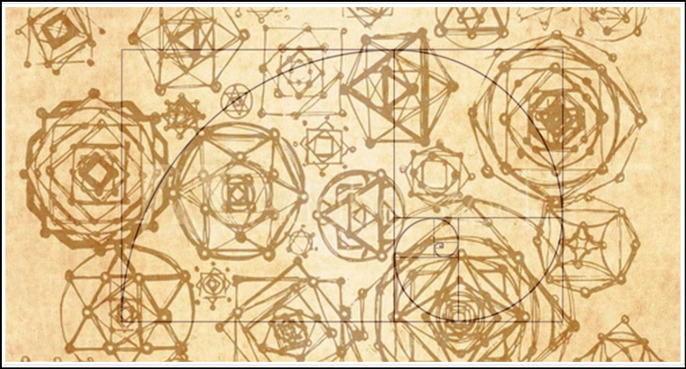
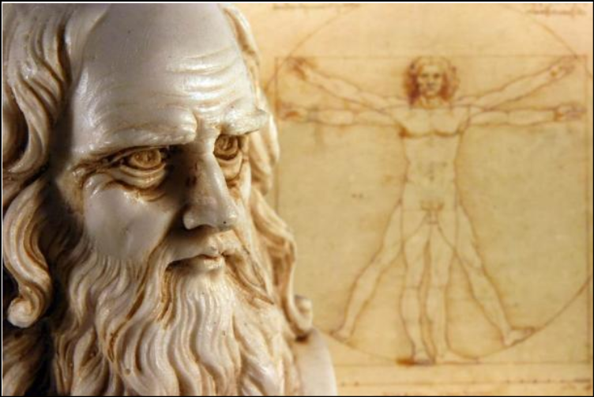
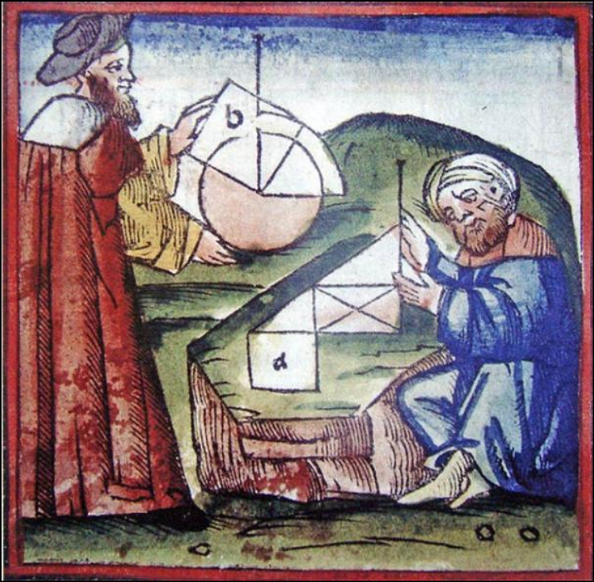

# 🛢️ Geometry-Shape-Calculator

⭐️ **Geometry** is one of the oldest fields of mathematics, linking points, lines, curves and shapes in space. Ancient scholars and builders relied on geometric principles: for example, surviving Egyptian papyri show they computed areas and volumes of architectural forms using geometric formulas. Even Plato remarked that “God geometrizes continually”, highlighting geometry’s deep role in understanding the universe. This Python-based **Geometry Shape Calculator** carries forward that tradition, providing a practical tool to compute areas, perimeters, volumes, and surface areas for a wide range of shapes.
 

  
<table>
  <tr>
    <td align="center">
      
       
      <em>Geometry Calculator Interface</em>
    </td>
    <td align="center">
      
       
      <em>Geometric Shapes Collection</em>
    </td>
  </tr>
</table>

## 👥 Team Members

- **Sayuri**
- **Sithum** 
- **Udesh**
- **Hirusha**
- **Imanya**
- **Sandali**
- **Malindu**

## 📋 Features

- **2D Shape Calculations** – Compute area and perimeter for shapes like circles, triangles, rectangles, squares, ellipses, and regular polygons.   
- **3D Shape Calculations** – Compute volume and surface area for solids like spheres, cubes, cylinders, cones, pyramids, and rectangular prisms.   
- **Detailed Explanations** – Provides intermediate results and formula breakdowns so users can see how each value is derived.   
- **User-Friendly CLI** – Intuitive command-line interface guides users through shape selection and input, suitable for students and developers alike.   
- **Error Handling** – Validates input dimensions and handles invalid entries gracefully, ensuring robust operation.   
- **Results Logging** – Optional logging of calculation results to a text file (geometry_results.txt) for review and record-keeping.    

## 🚀 Installation

1. **Clone the repository**:

       git clone https://github.com/kawdoco/Geometry-Shape-Calculator.git
       cd Geometry-Shape-Calculator

2. **Setup Environment**: Ensure you have Python 3.6 or higher installed.
 
       python3 --version

3. **(Optional) Create and activate a virtual environment**:

       python3 -m venv venv
       source venv/bin/activate  # On Windows use `venv\Scripts\activate`

4. **Install Dependencies**: (if any external libraries are used; this project may run with the Python standard library)

       pip install -r requirements.txt
 
 
## 💻 Usage

   *Run the main geometry calculator script from the command line* :
      
       python geometry.py

⭐️ Follow the interactive prompts to select a shape, enter its dimensions, and view the computed area/perimeter or volume/surface area. For example, you might choose Circle, then provide the radius when prompted. The program will display the result with the relevant formula. All outputs can also be saved automatically to geometry_results.txt.  

## Example Flow:

    1. Select shape category (2D/3D). 
    2. Choose specific shape (Circle, Triangle, etc.) 
    3. Enter required dimensions. 
    4. View results with formula explanation. 
    5. Optionally save to log file. 

## 📊 Supported Shapes

  *◆ Our calculator supports a broad range of common geometric shapes:*

- **2D Shapes**: Circle, Triangle, Rectangle, Square, Parallelogram, Ellipse, Pentagon, Hexagon, and other regular polygons.   
- **3D Shapes**: Sphere, Cube, Right Circular Cylinder, Right Circular Cone, Pyramid (square and triangular base), Rectangular Prism, and other standard solids.

⭐️ For each shape, the tool computes the appropriate properties (e.g., *area and perimeter* for 2D shapes, *volume* and *surface area* for 3D shapes) using well-known formulas. The interface may display reference diagrams or formulas during calculation to illustrate each computation.

## 🌐 Symbolic Meaning of Geometry

◆ Geometry has been more than just mathematics — it has carried **symbolic, spiritual, and architectural meaning** for centuries.

  
  
  
  *Sacred Geometry: Patterns that connect the cosmic and earthly realms*
  

### 🌀 Golden Ratio and Sacred Design

◆ The **Golden Ratio (φ)** has fascinated philosophers and architects since ancient times. Leonardo da Vinci’s works often used this divine proportion to bring harmony and beauty.

  
  
  
  *Da Vinci's Vitruvian Man exemplifies geometric perfection in human form*
  

### ✨ Shapes and Their Meanings

- **Circle** – Unity, perfection, eternity  
- **Triangle** – Balance, strength, harmony  
- **Square** – Stability, order, material world  
- **Pentagon / Golden Ratio** – Sacred geometry and cosmic patterns

  
  
  
  *Geometric shapes as archetypes of cosmic order*
  

## 📁 Project Structure

  ◆ The repository is organized as follows:

*Geometry-Shape-Calculator/*   
├── 📄 geometry.py              # Main program with calculation logic   
├── 📊 geometry_results.txt     # Calculation log (auto-generated)   
├── 📖 README.md                # Project documentation   
├── ⚖️ LICENSE                  # Project license   
├── 🧪 tests/                   # Unit tests and test data   
└── 🎨 assets/                  # Supporting images and resources   

◼ geometry.py – Contains the implementation of calculation functions for each shape, user prompts, and result formatting.   
◼ geometry_results.txt – A log file showing example usage outputs.     
◼ README.md – Project overview, installation and usage guide. (this document)  

## 🤝 Contributing

⭐️ Contributions are welcome! Whether you fix bugs, improve code, or add new shapes, you can help improve this tool. To contribute: fork the repository, create a feature branch, commit your changes with descriptive messages, and submit a pull request. Please also open an issue for any bugs or feature requests. We encourage best practices such as writing clear code, adding tests for new features, and documenting changes in the README or code comments.

 **Contribution Process:**

    1. Fork the repository
    2. Create a feature branch: git checkout -b feature/amazing-feature
    3. Commit your changes: git commit -m 'Add amazing feature'
    4. Push to the branch: git push origin feature/amazing-feature
    5. Open a Pull Request

## 📈 Recent Updates

◼ Latest Commit: Refactored calculation functions, added error checking for all inputs, and improved output formatting for clarity.    
◼ Added: Logging option to save results.      
◼ Improved: Modular code structure to simplify adding new shapes in the future.    
     *(The project is actively maintained; check the commit history or issue tracker for the latest details.)*

## 📞 Contact

⭐️ For questions, suggestions, or issue reports, please open an issue in the repository. This project was developed as a university final-year team project, and the maintainers are the team members listed above.

## 📋 References

⭐️ This tool is inspired by the long history of geometry. Definitions and properties of geometric shapes are based on standard mathematical sources (livetradingnews.com) For deeper historical context, note that many ancient cultures (including Egyptian builders and Greek mathematicians) applied geometry in architecture and science. These references highlight the enduring significance of geometry from ancient times to the present.

                                   🌟 Explore the mathematical beauty of our universe, one shape at a time 🌟 
